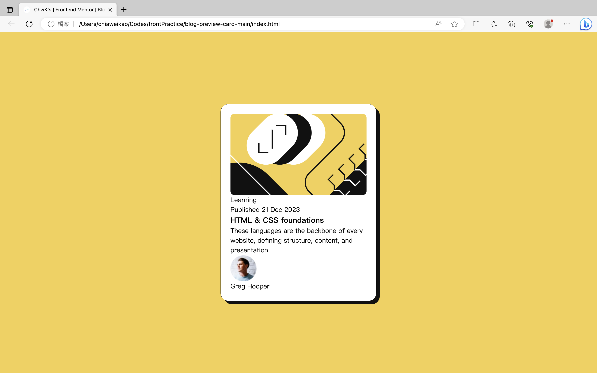

# Frontend Mentor - Blog preview card solution

This is a solution to the [Blog preview card challenge on Frontend Mentor](https://www.frontendmentor.io/challenges/blog-preview-card-ckPaj01IcS). Frontend Mentor challenges help you improve your coding skills by building realistic projects. 

## Table of contents

- [Overview](#overview)
  - [The challenge](#the-challenge)
  - [Screenshot](#screenshot)
  - [Links](#links)
- [My process](#my-process)
  - [Built with](#built-with)
  - [What I learned](#what-i-learned)
  - [Continued development](#continued-development)
  - [Useful resources](#useful-resources)
- [Author](#author)

## Overview

### The challenge

Users should be able to:

- See hover and focus states for all interactive elements on the page

### Screenshot

### Links

- Solution URL: [Add solution URL here](https://your-solution-url.com)
- Live Site URL: [Add live site URL here](https://your-live-site-url.com)

## My process

### Built with

- CSS custom properties
- [SASS](https://sass-lang.com/) - SASS

### What I learned

1. Using SASS language to generate CSS stylesheets.

### Continued development

- Set up the style of text parts.

### Useful resources

- [【CSS 教學】什麼時候該使用 margin 、padding？前端都該要懂的盒模型！](https://vocus.cc/article/61527178fd89780001a967da) - This helped me for setting up paddings and learning the types of boxess.

## Author

- Frontend Mentor - [@ChiaChiaWei](https://www.frontendmentor.io/profile/ChiaChiaWei)
- LinkedIn - [@Chia-Wei Kao](www.linkedin.com/in/chia-wei-kao)

